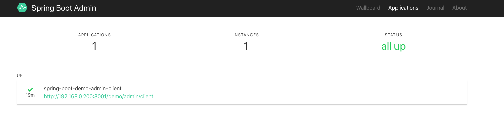

# spring-boot-demo-admin-server

## Spring Boot Admin
[官方介绍](https://codecentric.github.io/spring-boot-admin/current/#_what_is_spring_boot_admin)

Spring Boot Admin是一个开源社区项目，用于管理和监控SpringBoot应用程序。 应用程序作为Spring Boot Admin Client向为Spring Boot Admin Server注册（通过HTTP）或使用SpringCloud注册中心（例如Eureka，Consul）发现。
Spring Boot Admin UI 部分使用 VueJs 将数据展示在前端。

## Admin Client
### 项目依赖
> <spring.boot.version>2.1.0.RELEASE</spring.boot.version>
pom
```yaml
        <dependency>
            <groupId>org.springframework.boot</groupId>
            <artifactId>spring-boot-starter-web</artifactId>
        </dependency>

        <dependency>
            <groupId>de.codecentric</groupId>
            <artifactId>spring-boot-admin-starter-client</artifactId>
            <version>2.1.0</version>
        </dependency>

        <dependency>
            <groupId>org.springframework.boot</groupId>
            <artifactId>spring-boot-starter-security</artifactId>
        </dependency>
```

### 配置文件
```yaml
server:
  port: 8001
  servlet:
    context-path: /demo/admin/client
spring:
  application:
    # 在Spring Boot Admin Server中显示的名字
    name: spring-boot-demo-admin-client
  boot:
    admin:
      client:
        # Spring Boot Admin Server地址
        url: "http://localhost:8000"
        metadata:
          user.name: ${spring.security.user.name}
          user.password: ${spring.security.user.password}
  security:
    user:
      name: qu
      password: 123456
management:
  endpoint:
    health:
      # 端点健康情况，默认值"never"，设置为"always"可以显示硬盘使用情况和线程情况
      show-details: ALWAYS
  endpoints:
    web:
      exposure:
        # 打开客户端 Actuator 的监控, 参见spring boot demo actuator部分
        include: "*"
```

### 启动类
```java
@EnableAdminServer
@SpringBootApplication
public class SpringBootDemoAdminServerApplication {
    public static void main(String[] args) {
        SpringApplication.run(SpringBootDemoAdminServerApplication.class, args);
    }
}
```

启动服务端, 再启动客户端，访问http://localhost:8000可看到有客户端应用加入进来



