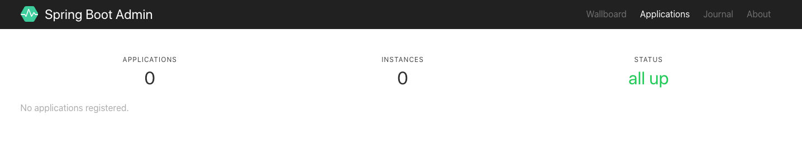

# spring-boot-demo-admin-server

## Spring Boot Admin
[官方介绍](https://codecentric.github.io/spring-boot-admin/current/#_what_is_spring_boot_admin)

Spring Boot Admin是一个开源社区项目，用于管理和监控SpringBoot应用程序。 应用程序作为Spring Boot Admin Client向为Spring Boot Admin Server注册（通过HTTP）或使用SpringCloud注册中心（例如Eureka，Consul）发现。
Spring Boot Admin UI 部分使用 VueJs 将数据展示在前端。

## Admin Server搭建
### 项目依赖
> 注意Spring Boot版本，如果用2.2.0则无法启动Admin Server
> <spring.boot.version>2.1.0.RELEASE</spring.boot.version>
pom
```yaml
        <dependency>
            <groupId>de.codecentric</groupId>
            <artifactId>spring-boot-admin-starter-server</artifactId>
            <version>2.1.0</version>
        </dependency>

        <dependency>
            <groupId>org.springframework.boot</groupId>
            <artifactId>spring-boot-starter-web</artifactId>
        </dependency>
```

### 配置文件
```yaml
server:
  port: 8000
```

### 启动类
```java
@EnableAdminServer
@SpringBootApplication
public class SpringBootDemoAdminServerApplication {
    public static void main(String[] args) {
        SpringApplication.run(SpringBootDemoAdminServerApplication.class, args);
    }
}
```

启动服务端，访问http://localhost:8000可看到如下界面



